# Počítadlo šipky

[](https://github.com/maty5302/Darts-Winform/actions/workflows/test.yml)
[](https://github.com/maty5302/Darts-Winform/actions/workflows/unit_tests_datalayer.yml)
[](https://github.com/maty5302/Darts-Winform/actions/workflows/integration_tests.yml)
[](https://github.com/maty5302/Darts-Winform/actions/workflows/build_app.yml)
[](https://github.com/maty5302/Darts-Winform/actions/workflows/release.yml)

🇬🇧 [English](README.md)
🇨🇿 [Čeština](README.cs.md)


Darts Counter je desktopová aplikace pro počítání skóre v šipkách. Aplikace podporuje klasickou hru, duel, trénink i turnaj a zároveň ukládá statistiky hráčů do databáze.


## Čeština / Czech

### Přehled

Aplikace je navržena pro hraní šipek v různých režimech a pro ukládání statistik jednotlivých hráčů. V současné verzi je projekt modernizován do novější architektury s použitím .NET 10, Avalonia a SQLite.

### Herní režimy

#### Klasická hra 301 / 501 / 701 / 901

Začíná se od stanoveného bodového limitu a hra pokračuje až do nuly. Podpora pro vícero hráčů, statistiky hodů a doporučení při uzavírání na double.

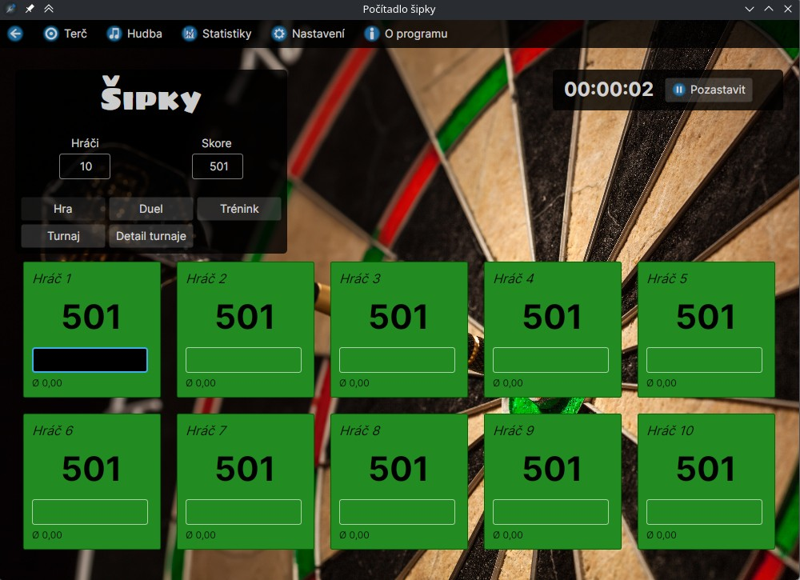

#### Duel

Podpora duelů 1v1, 2v2 a duelů na sety.

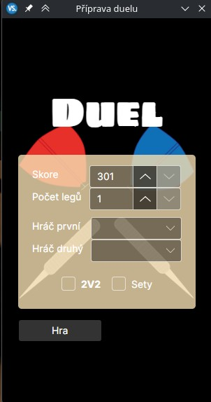
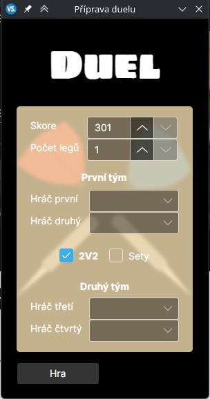

##### Duel 1v1

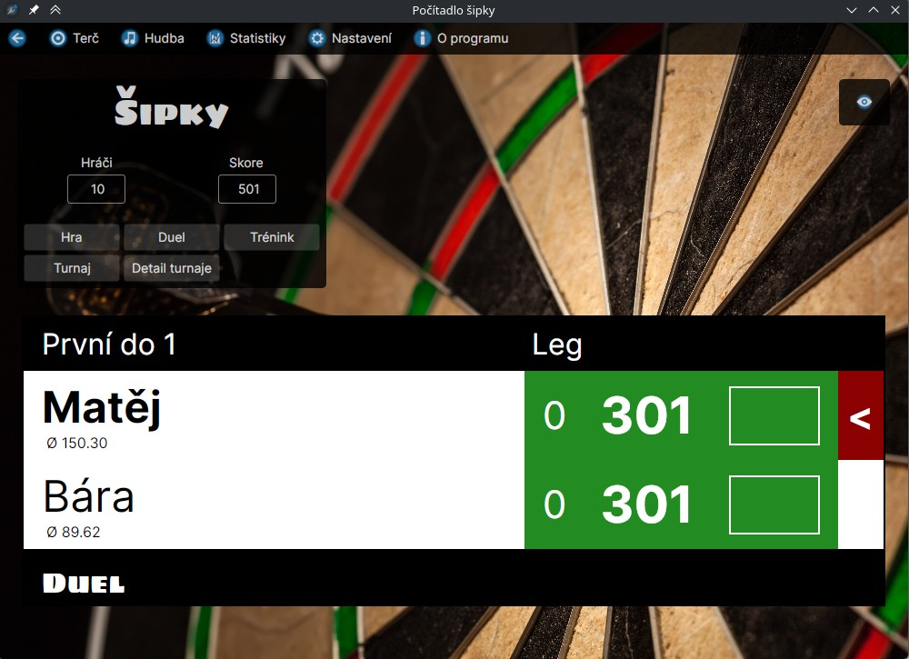

##### Duel 2v2

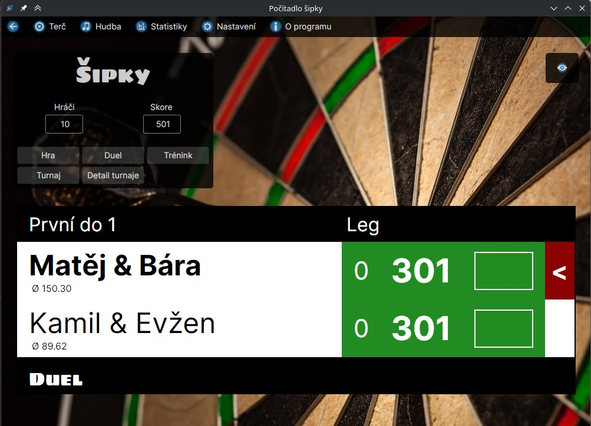

##### Duel sety 1v1

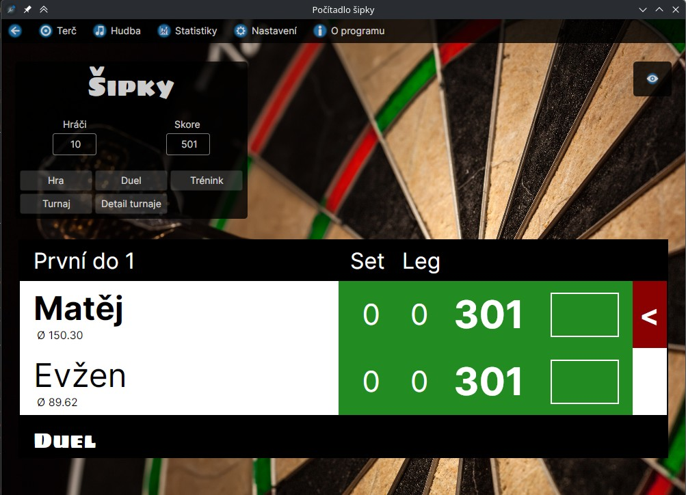

#### Trénink

Trénink nabízí single hody, double hody, triple hody, checkout a kombinované hody.

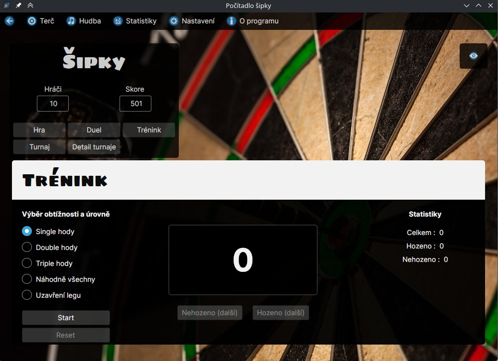

#### Turnaj

Turnaj pro 4, 8 nebo 16 hráčů s náhodným rozlosováním a přehledem postupu soutěže.

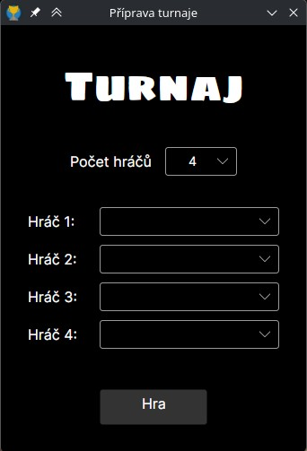


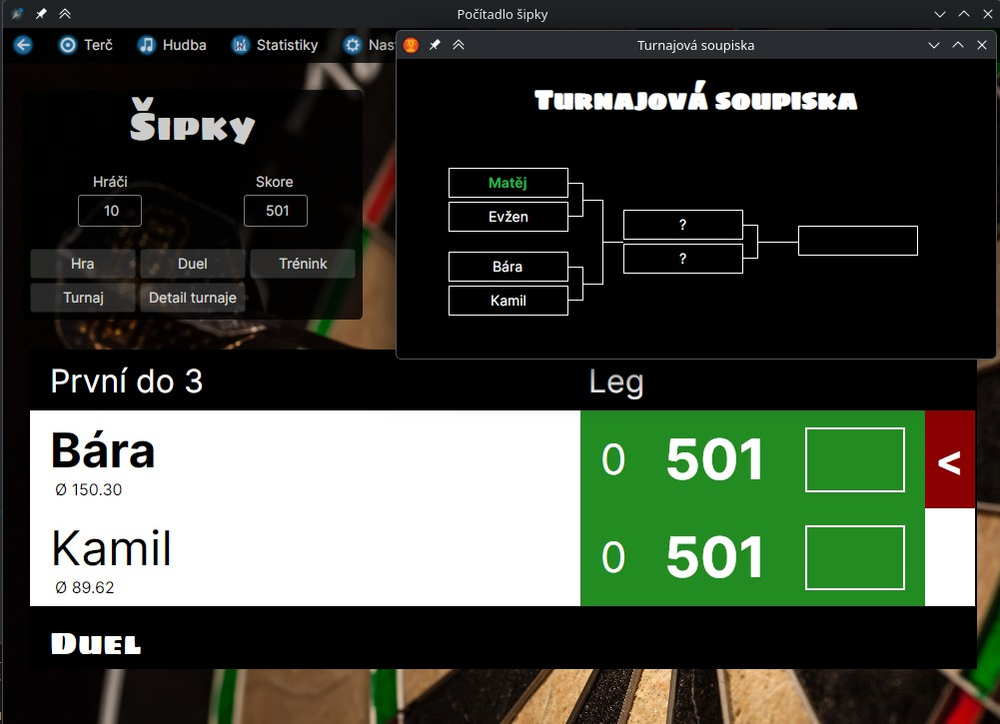

### Ostatní funkce

#### Statistiky

Statistiky jednotlivých hráčů se ukládají do databáze a zobrazují se pro aktuální rok i celou historii.

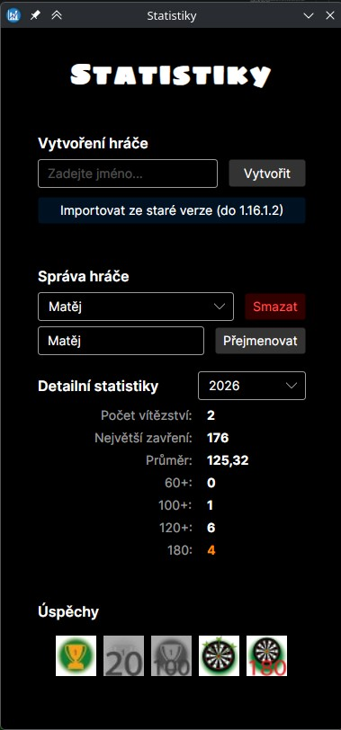 

#### Nastavení

Možnost upravovat jména a barvy hráčů, pozadí, průhlednost a profily nastavení.

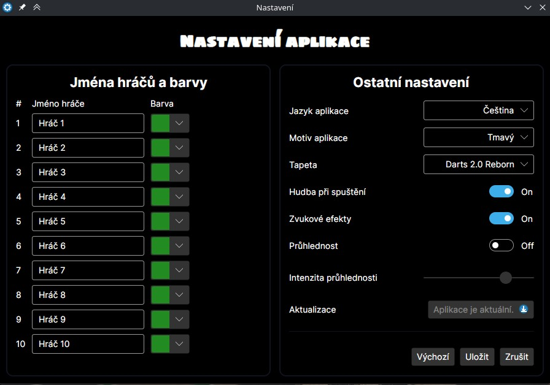

#### Hudba a aktualizace

Správa zvuku napříč aplikací a automatická kontrola dostupných aktualizací.

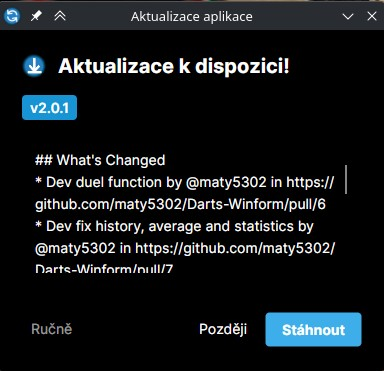

### Hlavní funkce

- Klasická hra pro 301 / 501 / 701 / 901 bodů
- Duel 1v1 a 2v2
- Duely na sety
- Trénink na single / double / triple / checkout / kombinované hody
- Turnaj pro 4, 8 nebo 16 hráčů
- Ukládání a správa hráčů v databázi
- Roční statistiky a přehledy výkonu
- Achievementy pro úspěšné výsledky
- Nastavení aplikace, pozadí, průhlednosti a jazyků
- Správa hudby a zvukových efektů
- Kontrola aktualizací a zobrazování changelogů
- Import staré databáze z předchozí verze

### Technologický stack

- .NET 10
- Avalonia UI
- SQLite via EF Core
- CommunityToolkit.Mvvm
- GitHub Actions CI/CD

### Struktura projektu

- `DesktopUI/` – desktopové UI a ViewModely
- `DataLayer/` – přístup k SQLite databázi a repository vrstva
- `Domain/` – modely, DTO a logika aplikace
- `Tests/` – jednotkové a integrační testy
- `installer.wixproj` / `installer.wxs` – instalace aplikace

### Jak spustit

Požadavky:

- .NET 10 SDK
- Windows, Linux nebo macOS podporovaný Avaloniou

Spuštění:

```bash
dotnet restore
 dotnet build
 dotnet run --project DesktopUI/DesktopUI.csproj
```

### Ukládání dat

Databáze se vytváří v lokálním adresáři aplikace pro uživatele a ukládá se v `DartsCounter` složce v `LocalApplicationData`.

### Licence

Tento projekt je distribuován jako opensource projekt pro osobní a studijní použití. Podrobnosti viz licence v repozitáři.

---

## Závěr

Tento projekt kombinuje klasickou hru v šipkách s moderním desktopovým rozhraním, databázovým uložením a rozšířenými statistikami. Rozsah aplikace přesahuje jednoduchý bodovací nástroj a poskytuje plnohodnotný systém pro správu her, hráčů a výkonu.