# Darts-Winform
Projekt vytvořen pro jednoduché počítadlo k sisalovému terči.
Postupně rozšířeno o další features za účelem rozšíření a vyzkoušení znalostí z jazyka C# a Winforms. Lze zde najít samostatnou databázi pro všechny uložené profily a hráče. 

## Herní mody
### Klasická hra 301/501/701/901
Začíná se od již zmíněného skore a pokračuje se do 0. Hra je určena pro 10 hráčů max. Lze hrát i jako jedna osoba. 
Zároveň se zaznamenává průměr vašého hodu a taky napovídání při uzavírání pomocí double.
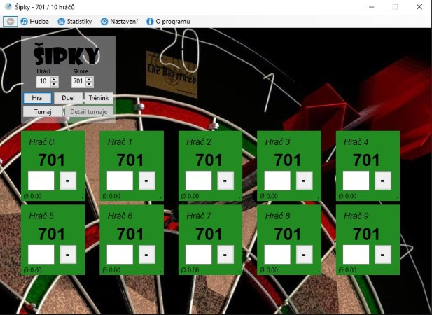

### Duel
Duel je možno hrát 1v1 nebo 2v2. Dále je možnost hrát duel na sety (pouze 1v1)

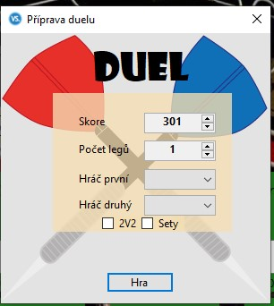
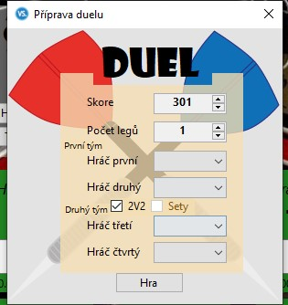

#### Duel 1v1
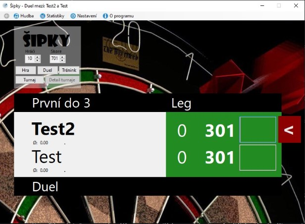
#### Duel 2v2
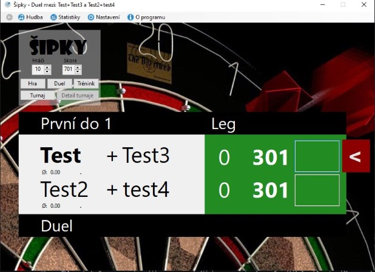
#### Duel Sety 1v1
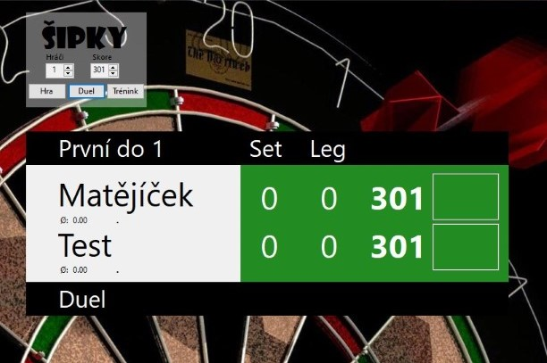

### Trénink
U tréninku je možnost si trénovat single hody, double hody, triple hody, uzavření legu, či všechny hody dohromady.

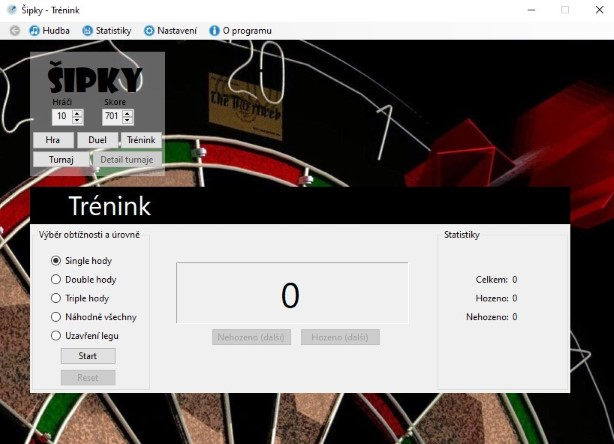

### Turnaj
Turnaj je určen pro 4, 8, nebo 16 hráčů. Lze zobrazovat průběh turnaje a jinak se zobrazuje klasicky jako duel 1v1 daný zápas. 
Po ukončení kola se ihned zobrazí další dvojice. Zápasy prvního kola jsou náhodně generovány.

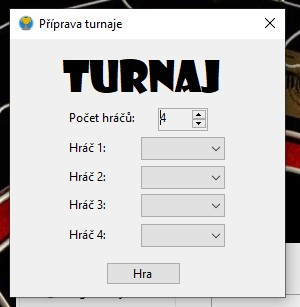

#### Vyobrazení turnaje s detailem turnaje
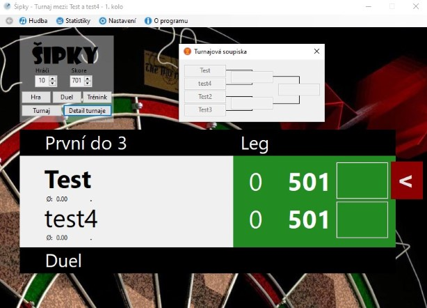

#### Vyobrazení postupu turnaje po odehrání prvního zápasu
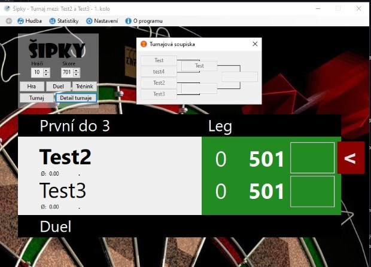

## Ostatní funkce
### Statistiky
Vyzobrazuje statistiky jednotlivých hráčů, kteří jsou vytvoření do databáze uživatelem. 
Statistiky se zobrazují ve dvou odděleních záložkách (za tento rok a za celou dobu). 
Statistiky se počítají při duelu či turnajim ale i v klasické hře když se hráč pojmenuje do písmene stejně jako ve statistikách.

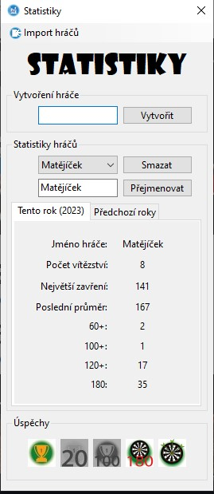

### Nastavení
V této sekci lze upravovat jména i barvy hráču u klasické hry. Dále jde nastavit i míra průhlednosti daných políček a změna pozadí.
Všechny tyto změny se dají ukládat do interní databáze a následně načítat jako pojmenované profily při každém spuštění hry. 

#### Hlavní stránka nastavení
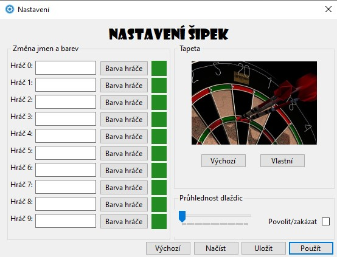
#### Načtení profilu nastavení 
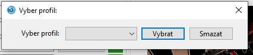
#### Uložení profilu nastavení 
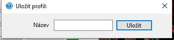

### Spouštění, zastavování či úplné ztlumení hudby
Ztlumením hudby se rozumí napříč programem, tudíž i oznamováním skore. Spouštět lze hlavní znělku a zastavovat lze veškeré zvuky. 

### Automatické vyhledávání aktualizací.

#### Upozornění na aktualizaci
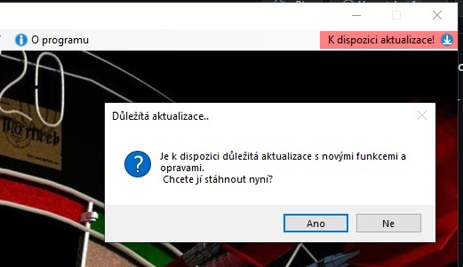
#### Zobrazení změn v nové verzi spolu s možností odložení, stažení či ručním stažením
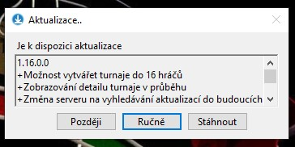
#### Průběh aktualizace
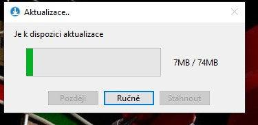