# Darts Counter

[](https://github.com/maty5302/Darts-Winform/actions/workflows/test.yml)
[](https://github.com/maty5302/Darts-Winform/actions/workflows/unit_tests_datalayer.yml)
[](https://github.com/maty5302/Darts-Winform/actions/workflows/integration_tests.yml)
[](https://github.com/maty5302/Darts-Winform/actions/workflows/build_app.yml)
[](https://github.com/maty5302/Darts-Winform/actions/workflows/release.yml)

🇬🇧 [English](README.md)
🇨🇿 [Čeština](README.cs.md)


This project is a desktop darts scoring application. It supports classic games, duels, training modes, and tournaments while storing player statistics in a database.


## English / Anglicky

### Overview

Darts Counter is a desktop darts scoring application designed for playing in different game modes and tracking player performance over time. The current version has been modernized into a cleaner architecture using .NET 10, Avalonia, and SQLite.

### Game modes

#### Classic 301 / 501 / 701 / 901

The round starts from a fixed score and continues until the player reaches zero with valid finishes and accuracy checks.

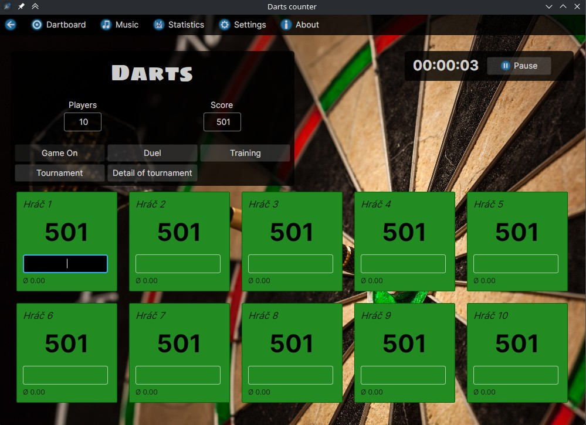

#### Duel

Supports 1v1, 2v2, and set-based matches.

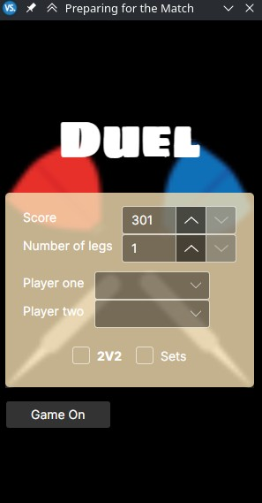
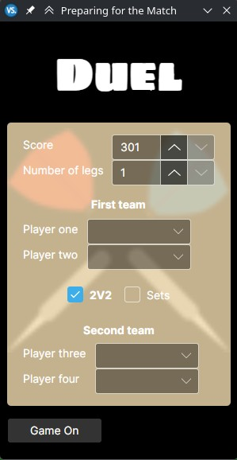

##### Duel 1v1

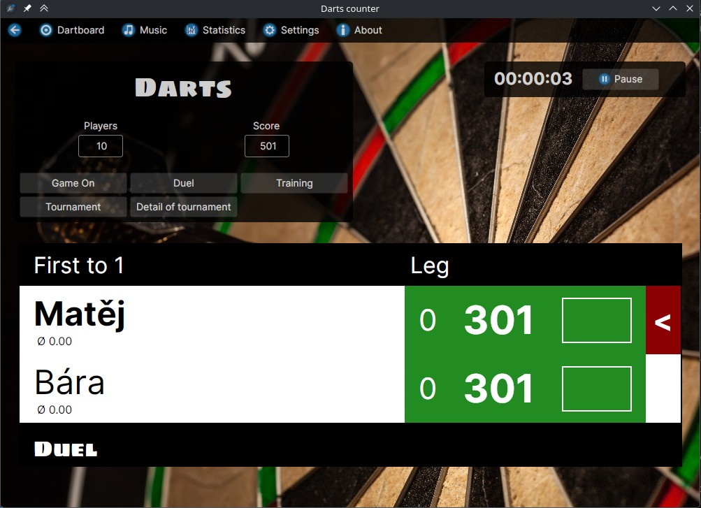

##### Duel 2v2

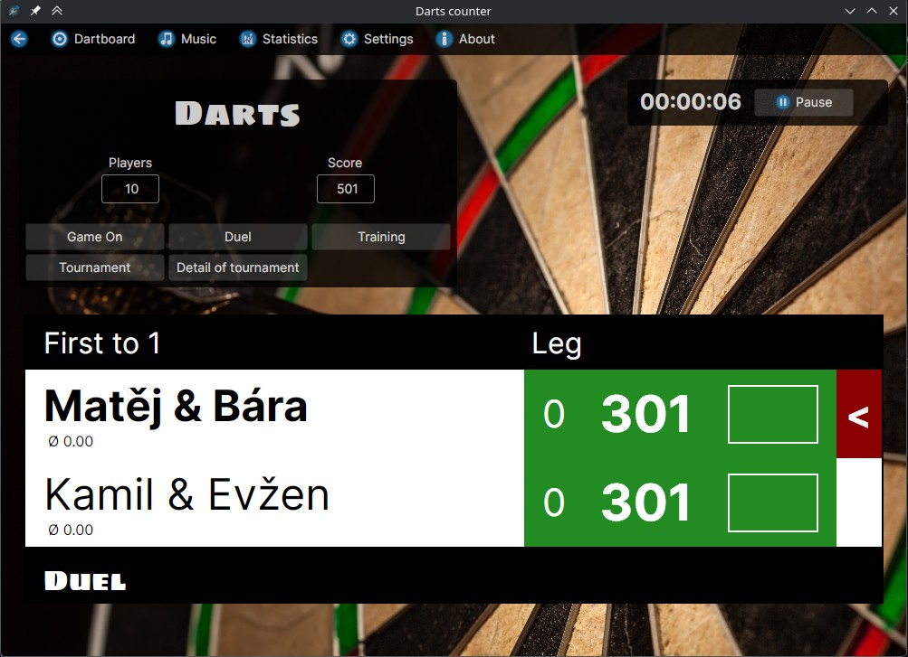

##### Duel sets 1v1

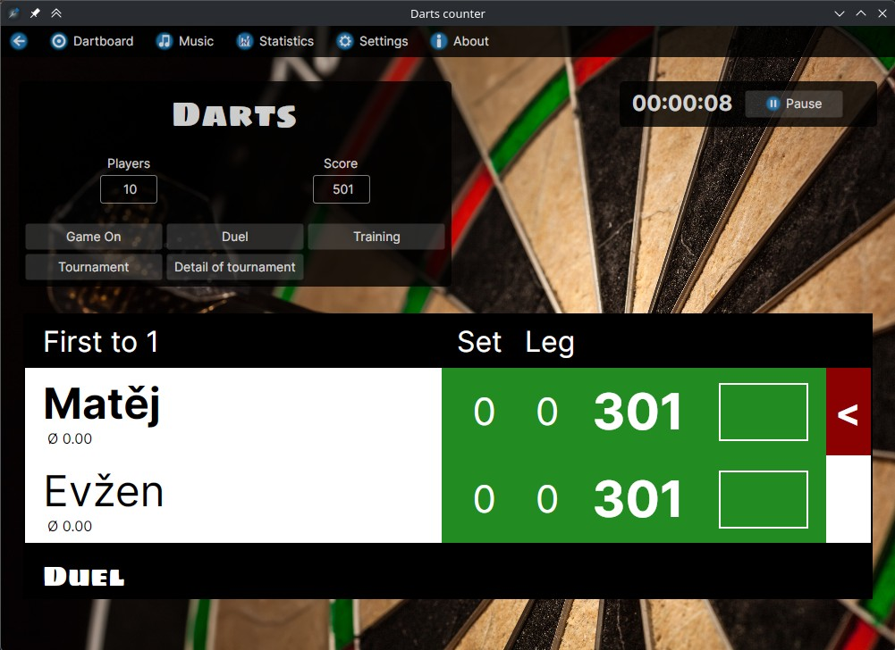

#### Training

Training supports singles, doubles, triples, checkout practice, and mixed shot sessions.

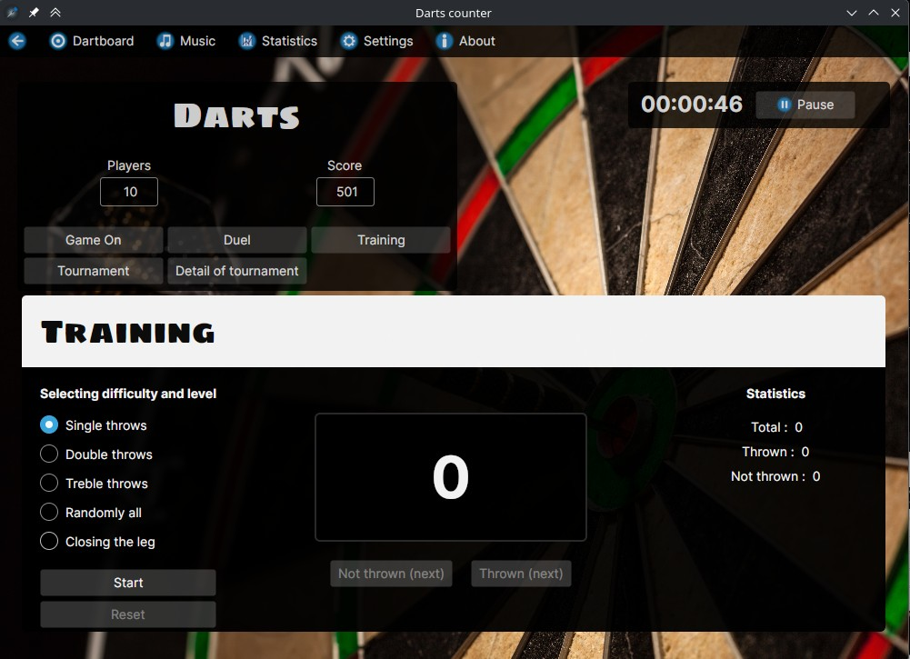

#### Tournament

Tournament mode supports 4, 8, or 16 players with bracket progression and match flow.

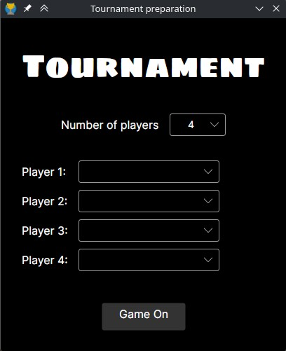

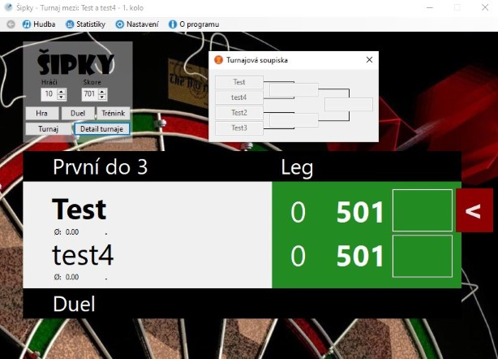

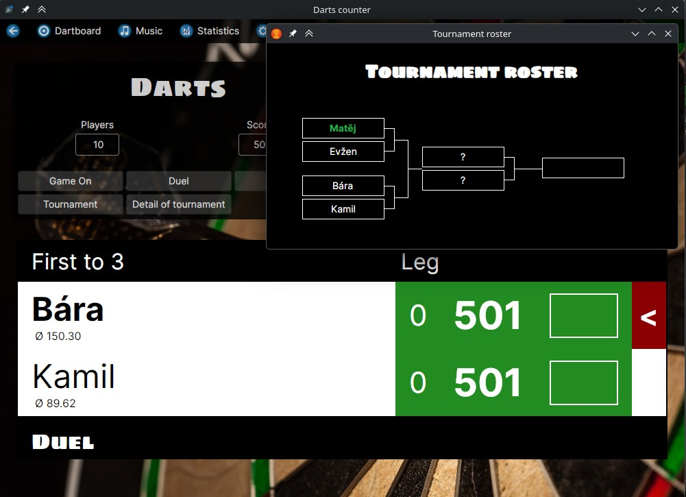

### Other features

#### Statistics

Player statistics are stored in the database and displayed for the current year and lifetime history.

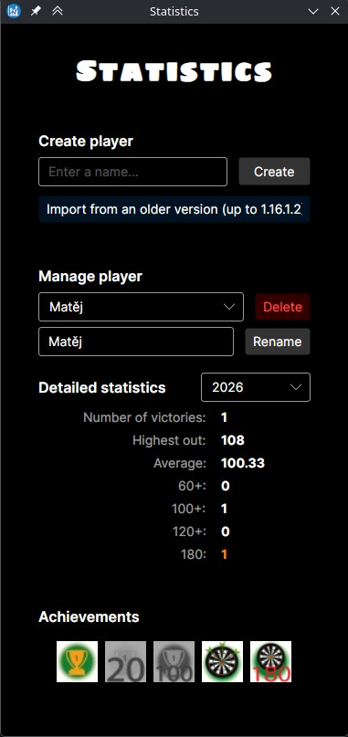

#### Settings

Manage player names and colors, background images, transparency, and saved profiles.

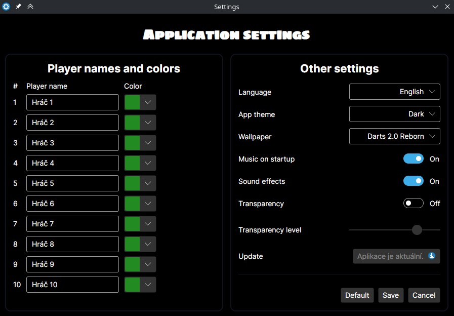
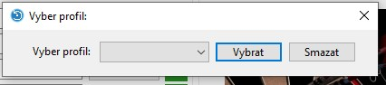
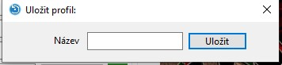

#### Music and updates

Control sound effects across the app and check for new versions with changelog support.

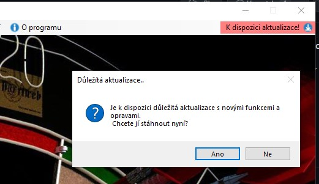
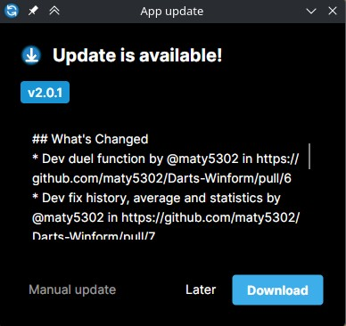
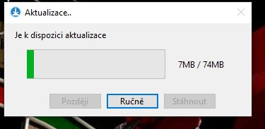

### Main features

- Classic game modes: 301 / 501 / 701 / 901
- 1v1 and 2v2 duel modes
- Set-based duels
- Training modes for singles, doubles, triples, checkout, and mixed shots
- Tournament mode for 4, 8 or 16 players
- Player management and persistent storage in a database
- Yearly and lifetime statistics
- Achievement system for milestones and wins
- App settings for themes, opacity, backgrounds, and language
- Music and sound effects control
- Update checking and changelog support
- Import support for legacy databases from previous versions

### Tech stack

- .NET 10
- Avalonia UI
- SQLite with EF Core
- CommunityToolkit.Mvvm
- GitHub Actions for CI/CD

### Project structure

- `DesktopUI/` – desktop UI and view models
- `DataLayer/` – SQLite access and repository layer
- `Domain/` – models, DTOs, and game logic
- `Tests/` – unit and integration tests
- `installer.wixproj` / `installer.wxs` – application installer

### How to run

Requirements:

- .NET 10 SDK
- Windows, Linux, or macOS compatible with Avalonia

Run:

```bash
dotnet restore
 dotnet build
 dotnet run --project DesktopUI/DesktopUI.csproj
```

### Data storage

The database is created in the user's local application data folder under the `DartsCounter` directory inside `LocalApplicationData`.

### License

This project is distributed as an open-source project for personal and educational use. Please check the repository license file for full details.

---

## Summary

This project combines classic darts gameplay with a modern desktop interface, persistent data storage, and advanced player statistics. It goes beyond a simple score tracker and provides a complete system for managing matches, players, and performance history.
